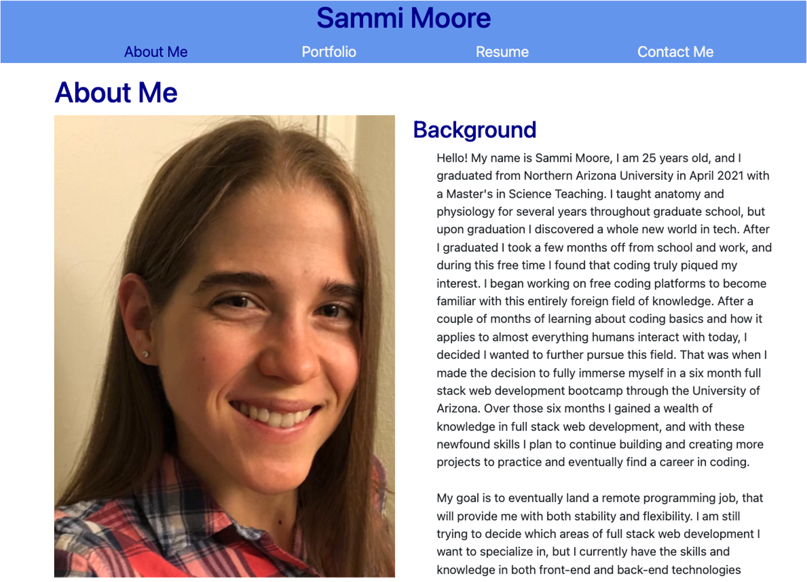
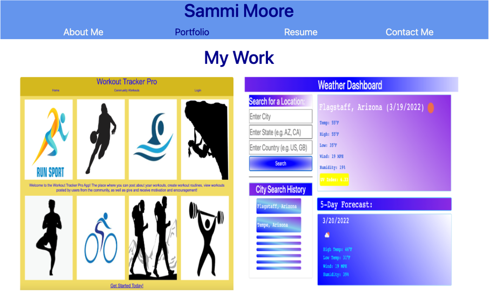
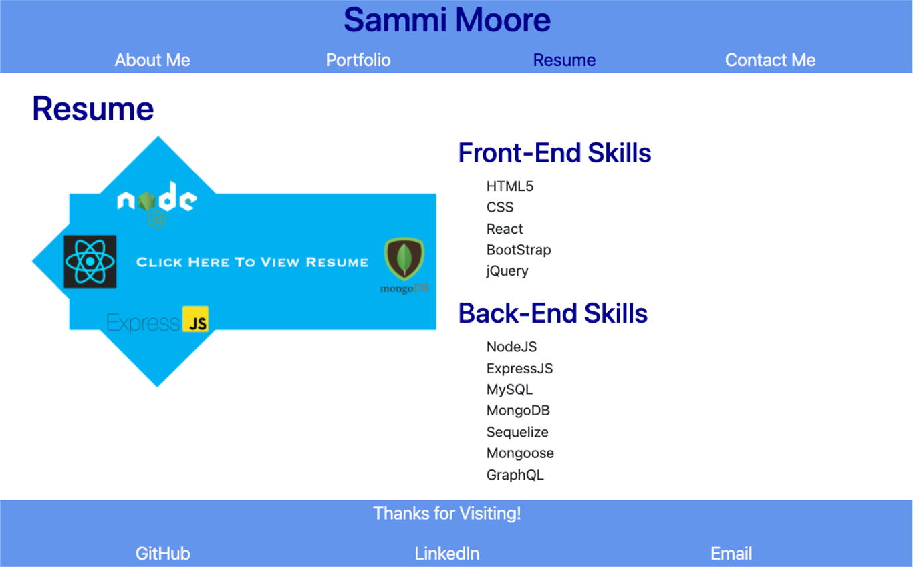
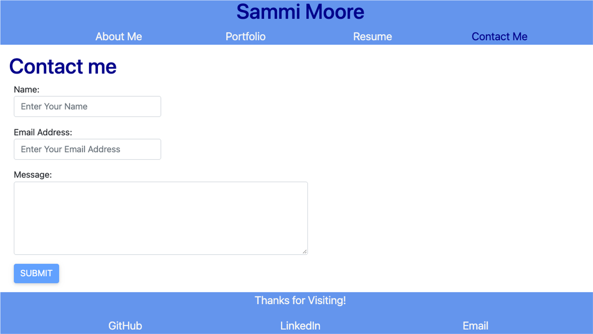

# Sammi Moore Portfolio

# Description
The goal of this project was to design a responsive and creative professional portfolio in React to showcase my prior and future coding projects. This professional portfolio is meant to provide potential employers with information about myself and the coding work I have conducted. Previously I created a professional portfolio using HTML and CSS, so this iteration was meant to vastly improve upon the layout, design, and functionality of my portfolio. The purpose of creating this portfolio webpage was to have a space where I can easily organize, update, and present projects I have created. 

This portfolio webpage is mobile friendly, accessible, and contains navigation links, project images/links, and contact information. It was designed to be user-friendly and allow for effortless navigation and discovery. 

# Table of Contents
- [Built With](#built-with)
- [Code Access](#code-access)
- [Usage](#usage)
- [Preview](#preview)
- [Portfolio Link](#portfolio-link)
- [License](#license)
- [Questions](#questions)
- [Credit](#credit)
- [Contribution](#contribution)

# Built With
This portfolio was created using:
- React.js
- Javascript
- BootStrap
- React BootStrap
- CSS

# Code Access

If you would like to access the code for this portfolio, please visit [GitHub](https://github.com/sm3131/sammi-portfolio)

# Usage
In order to fully experience my professional portfolio, follow the descriptions below as they outline the functionality and features of the webpage.

- Upon visiting the portfolio (using the link provided in the "Portfolio Link" section below) you will be directed to the About Me page.
- The About Me page features a couple of pictures of myself and provides a background, skills section, and other interests section.
- Then at the top of the page you will see a navigation bar below my name with several pages you can visit.
- The next page you can visit is the portfolio page.
- The portfolio page contains six of my larger coding projects.
- Each image you see on the page is one project, and by hovering over the images you will see a link to the deployed project site, and a github icon to visit the project's github repository.
- The next page is the Resume page which provides a link to my downloadable professional resume, and it provide a more specific outline of the technologies I am proficient in on the front-end and back-end.
- The final page you can visit is the Contact Me page, which provides a form you can fill out with your name, email, and a message with any questions, comments, or concerns you have about my portfolio.
- At the footer of the page, there are three links, one for my GitHub, LinkedIn, and Email, each of these will take you to the appropriate place.

# Preview
Below are several screenshots providing a preview of the professional portfolio webpage:
  

 

# Portfolio Link
The link to my professional portfolio is:

https://sm3131.github.io/sammi-portfolio/

# License

MIT License

Copyright (c) 2022 Sammi Moore

Permission is hereby granted, free of charge, to any person obtaining a copy
of this software and associated documentation files (the "Software"), to deal
in the Software without restriction, including without limitation the rights
to use, copy, modify, merge, publish, distribute, sublicense, and/or sell
copies of the Software, and to permit persons to whom the Software is
furnished to do so, subject to the following conditions:

The above copyright notice and this permission notice shall be included in all
copies or substantial portions of the Software.

THE SOFTWARE IS PROVIDED "AS IS", WITHOUT WARRANTY OF ANY KIND, EXPRESS OR
IMPLIED, INCLUDING BUT NOT LIMITED TO THE WARRANTIES OF MERCHANTABILITY,
FITNESS FOR A PARTICULAR PURPOSE AND NONINFRINGEMENT. IN NO EVENT SHALL THE
AUTHORS OR COPYRIGHT HOLDERS BE LIABLE FOR ANY CLAIM, DAMAGES OR OTHER
LIABILITY, WHETHER IN AN ACTION OF CONTRACT, TORT OR OTHERWISE, ARISING FROM,
OUT OF OR IN CONNECTION WITH THE SOFTWARE OR THE USE OR OTHER DEALINGS IN THE
SOFTWARE.

# Questions

If you would like to access this project's repository as well as other projects in my GitHub, click this [GitHub](https://github.com/sm3131) link. 

For all other questions or inquires please feel free to contact me via email at [sm2683@nau.edu](mailto:sm2683@nau.edu)

# Credit
This webpage was created using the following resources and technologies:
- Create React App to set-up and create the initial React front-end (https://reactjs.org/docs/create-a-new-react-app.html)
- Bootstrap for styling of the pages, specifically grid layout, forms, and spacing (https://getbootstrap.com/docs/5.1/getting-started/introduction/)
- React Bootstrap for hover effects and image overlays (https://react-bootstrap.github.io/getting-started/introduction)
- Guidance from module 20, such as React set-up, components, hooks, and rendering

# Contribution

This professional portfolio was created entirely by myself, Sammi Moore. I worked individually on this project to design a creative and functioning webpage that showcases my coding work and provides information about myself. 
